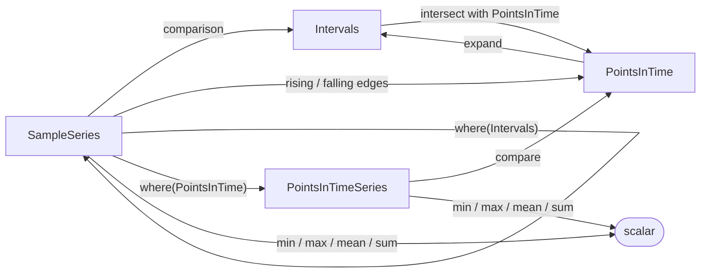

# Core Data Model

Every [TSAL](tsal.md) expression is lazy — it describes *what* to compute, not *how*. When a solver
runs the query, each expression is evaluated **per container** and resolves to one of a small set of
in-memory, numpy-backed classes. Those classes are the **core data model**:

| Class                | Carries values? | Has duration? | Typical source                                  |
|----------------------|-----------------|---------------|-------------------------------------------------|
| `SampleSeries`       | yes             | yes           | channel selection, arithmetic, resampling       |
| `Intervals`          | no              | yes           | comparison / logical operators, edge windows    |
| `PointsInTime`       | no              | no            | `rising_edges()` / `falling_edges()`            |
| `PointsInTimeSeries` | yes             | no            | sampling a signal at instants via `where(...)`  |

:::note Not the storage schema
This page describes the **in-memory result classes** a query evaluates to. It is unrelated to the
[Data Model](../data_model/index.md) section, which documents the **silver-layer storage schema**
(the Delta tables Impulse reads from). The core data model lives only in memory during query
execution.
:::

## The classes at a glance



---

## SampleSeries

A measured signal, stored as three aligned arrays `(tstarts, tends, values)`. Two distinct
assumptions define its semantics:

- **The series is *valid* across its intervals.** Each half-open `[tstart_i, tend_i)` is an interval
  over which the signal was available (being recorded). It is this validity — not the values — that
  synchronization relies on. The intervals may have gaps; in a gap the signal is not valid.
- **Each value is a measurement that stands as the most recent one.** A value `v_i` was measured *at*
  `tstart_i`, and no other value was measured until `tend_i` (exclusive). So at any instant inside
  `[tstart_i, tend_i)`, `v_i` is the most recently measured value — not necessarily the "true" value
  at that instant.

```python
SampleSeries([0, 1, 2], [1, 2, 3], [10, 20, 30])
# the signal is valid on [0, 3); 10 was measured at t=0 and is the most
# recent value until t=1, 20 the most recent until t=2, 30 until t=3
```

These two assumptions are what make signals composable: two `SampleSeries` recorded at different
sample rates can be **synchronized** onto a common set of intervals (using their validity) before an
operation, and aggregations are **duration-weighted** — a measurement that is the most recent value
for 2 s counts twice as much as one that stands for 1 s.

Key operations: arithmetic (`+ - * / %`) and comparisons (which produce `Intervals`),
`where(...)`, `resample()`, `synchronized()`, `rolling_average()` / `rolling_stats()`,
`trapz()` / `cumtrapz()`, `rising_edges()` / `falling_edges()`, `histogram()`, and the
duration-weighted reducers `sum()` / `min()` / `max()` / `mean()`.

→ API: [`SampleSeries`](api/impulse_query_engine/model/series/sample_series.md)

---

## Intervals

A set of time windows `(tstarts, tends)` with **no values** — just *when* something is true. This is
the result of every comparison and logical operator, and therefore the building block of events.

```python
eng_rpm > 2000          # Intervals: every window where RPM exceeds 2000
(a > 2000) & (a < 5000) # intersection of two Interval sets
```

Key operations: `&` (intersection), `|` (union), `expand()` / `shrink()` (grow or contract window
bounds), `merge_overlaps()` / `merge_intervals(gap)`, `debounce(d)`, and `filter(d)` (drop windows
shorter than `d`). Intersecting `Intervals` with a `PointsInTime` keeps only the points that fall
inside a window and returns a `PointsInTime`.

→ API: [`Intervals`](api/impulse_query_engine/model/series/intervals.md)

---

## PointsInTime

A set of bare timestamps `(tstarts)` — **no duration, no values**. Produced by edge detection on a
`SampleSeries`, where each timestamp marks the instant the signal rose or fell.

```python
eng_rpm.rising_edges()   # PointsInTime: instants where RPM increased
```

Key operations: `&` / `|` (set intersection / union by timestamp) and `expand()` / `expand_left()`
/ `expand_right()`, which widen each point into a window and return `Intervals`.

→ API: [`PointsInTime`](api/impulse_query_engine/model/series/points_in_time.md)

---

## PointsInTimeSeries

A timestamp→value series `(tstarts, values)`. It is the value-carrying counterpart of
`PointsInTime`, and the point-wise counterpart of `SampleSeries` — but with one decisive difference
from `SampleSeries`: **a value pertains only *to* its own timestamp** and makes no claim about the
signal in between consecutive timestamps. There are no durations and no most-recent-value carried
forward — each value stands alone at its instant.

The natural way to obtain one is to **sample a signal at specific instants** — e.g. read engine RPM
exactly at the moments the vehicle starts moving:

```python
rpm_at_starts = eng_rpm.where(veh_spd.rising_edges())  # PointsInTimeSeries
```

Because there is no validity between points, the operators differ from `SampleSeries`:

- **Arithmetic** (`+ - * /`) with another `PointsInTimeSeries` aligns the two on **exactly matching
  timestamps** (a value at one instant can only combine with a value at the *same* instant); with a
  scalar it applies element-wise. A `SampleSeries` operand is sampled at this series' instants first.
- **Comparisons** (`> >= < <= == !=`) return a `PointsInTime` — the instants where the condition
  holds (mirroring how `SampleSeries` comparisons return `Intervals`).
- **Aggregations** `sum()` / `mean()` / `min()` / `max()` / `count()` are **unweighted** (plain
  reductions over the values), since there are no durations to weight by — in contrast to
  `SampleSeries`' duration-weighted reducers.
- **`synchronized()` / `synchronized_all()`** align this series with a `SampleSeries` or another
  `PointsInTimeSeries` onto their shared instants, returning value-carrying point series.

→ API: [`PointsInTimeSeries`](api/impulse_query_engine/model/series/points_in_time_series.md)

---

## How the classes interact

Operations move between the four classes (and scalars) in well-defined ways:

| From                 | Operation                                      | Produces             |
|----------------------|------------------------------------------------|----------------------|
| `SampleSeries`       | `+ - * /` with a scalar or another series      | `SampleSeries`       |
| `SampleSeries`       | `> >= < <= == !=`                              | `Intervals`          |
| `SampleSeries`       | `rising_edges()` / `falling_edges()`           | `PointsInTime`       |
| `SampleSeries`       | `where(Intervals)`                             | `SampleSeries`       |
| `SampleSeries`       | `where(PointsInTime)`                          | `PointsInTimeSeries` |
| `SampleSeries`       | `sum()` / `min()` / `max()` / `mean()`         | scalar               |
| `Intervals`          | `&` / `\|`                                     | `Intervals`          |
| `Intervals`          | `& PointsInTime`                               | `PointsInTime`       |
| `PointsInTime`       | `expand()` / `expand_left()` / `expand_right()`| `Intervals`          |
| `PointsInTimeSeries` | `> >= < <= == !=`                              | `PointsInTime`       |
| `PointsInTimeSeries` | `+ - * /`                                      | `PointsInTimeSeries` |
| `PointsInTimeSeries` | `sum()` / `mean()` / `min()` / `max()`         | scalar               |

`where(PointsInTime)` is the bridge from a continuous signal to a point series: for each requested
instant it takes the most recently measured value at that instant — the value of the sample interval
`[tstart, tend)` that contains it — and keeps it. **Points that fall outside every sample interval**
— in a gap, before the first or after the last sample, where the signal is not valid — **are
dropped**, so the result may be shorter than the input.

A short example chaining several transitions — read the engine RPM at each wheel-speed rising edge,
then keep only the high-RPM starts:

```python
starts = veh_spd.rising_edges()            # PointsInTime
rpm_at_starts = eng_rpm.where(starts)      # PointsInTimeSeries
hot_starts = rpm_at_starts > 3000          # PointsInTime (instants only)
avg_start_rpm = rpm_at_starts.mean()       # scalar (unweighted)
```

---

## From TSAL to the core data model

A TSAL expression is a **lazy tree** of typed nodes — `TimeSeriesSelector` (a channel leaf),
`TimeSeriesOp` (an arithmetic / comparison / logical / method node), `TimeSeriesAliasSelector`, and
`TimeSeriesUDF` (see [Expression types](tsal.md#expression-types)). Building the tree computes
nothing.

When [`QueryBuilder.solve()`](tsal.md) runs, the [solver](query_engine.md) does the following per
container:

1. **Resolve leaves.** Each `TimeSeriesSelector` is matched to a physical channel and loaded into a
   `SampleSeries` from the silver-layer data.
2. **Evaluate bottom-up.** Each `TimeSeriesOp` calls the corresponding method/operator on the
   core-model object its children produced — e.g. `eng_rpm > 2000` builds a `SampleSeries` for
   `eng_rpm`, then the `>` op turns it into an `Intervals`. The result of the whole tree is one
   core-model object (or a scalar) per container.
3. **Serialize into the output DataFrame.** Each result type maps to a Spark column type:

   | Result type          | Spark column type                  | How it is stored        |
   |----------------------|------------------------------------|-------------------------|
   | `SampleSeries`       | `BinaryType`                       | serialized (pickle+lz4) |
   | `Intervals`          | `ArrayType(ArrayType(DoubleType))` | `[[tstart, tend], ...]` |
   | `PointsInTime`       | `ArrayType(DoubleType)`            | `[tstart, ...]`         |
   | `PointsInTimeSeries` | `ArrayType(ArrayType(DoubleType))` | `[[tstart, value], ...]`|
   | scalar               | `DoubleType`                       | the value               |

`toPandas()` deserializes the binary `SampleSeries` columns back into objects; the array-backed
types are returned as nested lists. See [Query Engine](query_engine.md) for the full solver pipeline
and how to choose between `DeltaSolver` and `KeyValueStoreSolver`.
