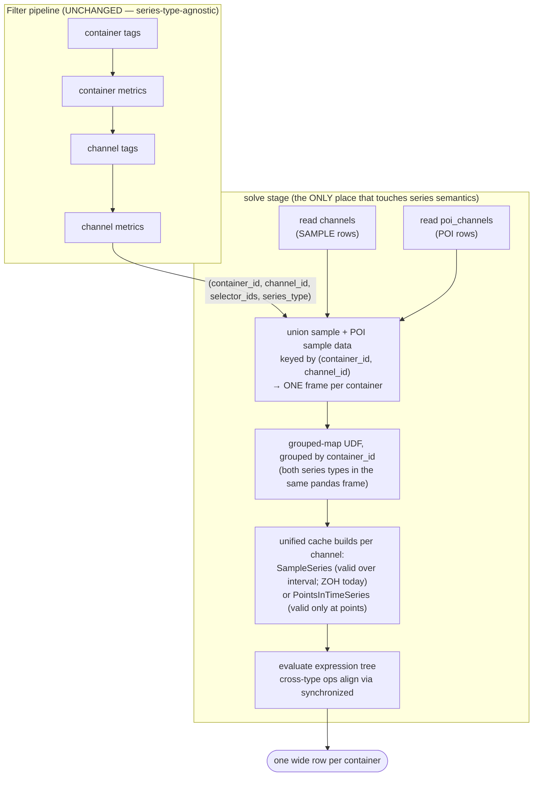
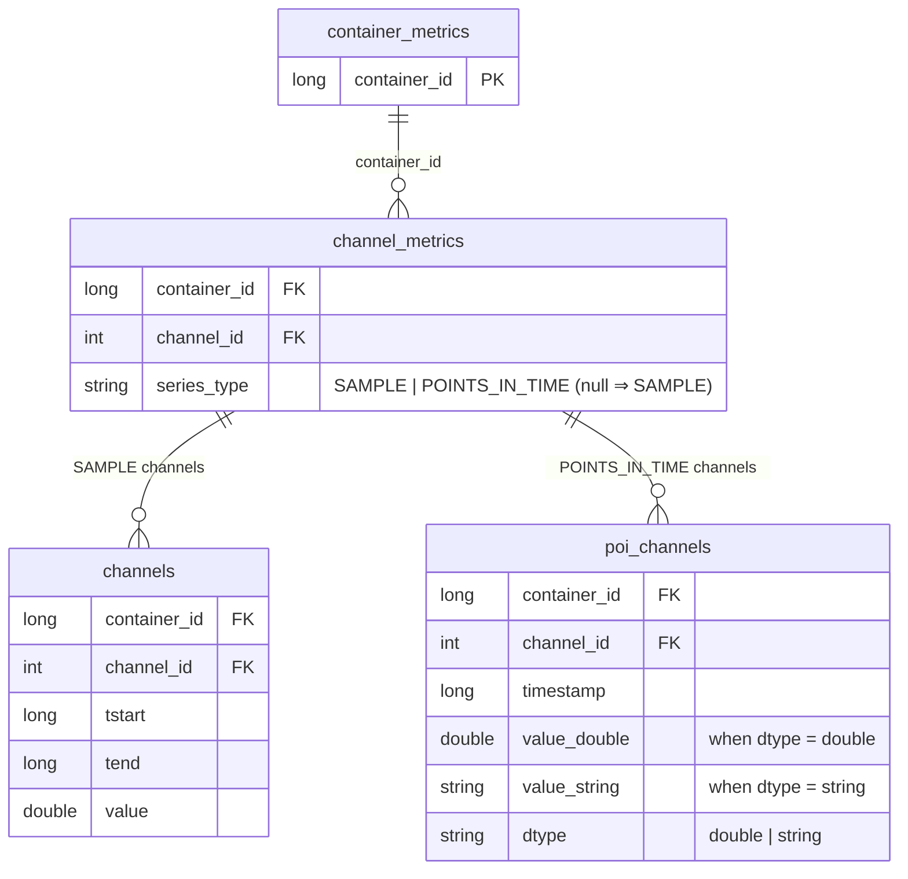

# Design: Integrating Points-in-Time (POI) Series into the Silver Layer

**Status:** Proposed &nbsp;·&nbsp; **Scope:** `impulse_query_engine` silver-layer
data model + `DefaultSolver` solve stage &nbsp;·&nbsp; **Non-goal:** changing the
6-stage filter pipeline.

## 1. Summary

Impulse currently models every channel as a **sample series** — a sequence of
`[tstart, tend)` intervals over which the series is assumed to be **valid** (this
validity is what channel synchronization relies on). It does *not* intrinsically
assume the value is *held constant* over the interval: how a value is reconstructed
within `[tstart, tend)` is an **interpolation** choice. Today the only interpolation
used is **zero-order hold** (the value at `tstart` carries forward), but additional
interpolation methods could be added in the future without changing the underlying
validity model. We want to add a second kind of channel, a **Points-in-Time (POI)
Series**: a list of `(tᵢ, vᵢ)` pairs where each value is defined **only at its
timestamp** and **no assumption of validity (and hence no interpolation) is made
between two consecutive timestamps**.

The backend model class already exists —
[`PointsInTimeSeries`](../references/api/impulse_query_engine/model/series/points_in_time_series.md)
— and already implements arithmetic, comparisons, `synchronized` / `synchronized_all`,
and the reducing aggregations (`count`, `sum`, `mean`, `min`, `max`). The
integration work is therefore **not** about series math; it is about:

1. **Where POI samples live in silver** (a new `poi_channels` table), and
2. **How the solver knows a channel is POI** — table membership (data in
   `poi_channels` ⇒ POI) plus the query author's `poi_channel(...)` selector; no
   explicit `series_type` column is needed (see [§3.2](#32-discriminator-table-membership-which-table-holds-the-channels-data)), and
3. **How the solve step builds a `PointsInTimeSeries` instead of a `SampleSeries`**
   for those channels.

The central design observation is that the entire metadata **filter pipeline is
already series-type-agnostic**, so POI support drops into the *solve* stage only.

:::note Terminology

- **Sample series** — the existing channel type; `[tstart, tend)` intervals over
  which the series is *valid*, with values reconstructed by an interpolation method
  (zero-order hold today). Backed by `SampleSeries`.
- **POI series** — the new channel type; `(tᵢ, vᵢ)` points valid *only at* their
  timestamps, with no between-point validity or interpolation. Backed by
  `PointsInTimeSeries`.

:::

### 1.1 Motivating example: ECU defect / error codes (DTCs)

The canonical real-world POI series in vehicle testing is the stream of **defect
codes** (a.k.a. error codes, or **Diagnostic Trouble Codes — DTCs**) emitted by a
vehicle's Electronic Control Units (ECUs). When an ECU's diagnostic monitor detects
a fault — a misfire, a sensor reading out of range, a lost CAN message — it emits a
code at the **instant the fault is registered**. In a test fleet these are captured
off the CAN/UDS bus (e.g. via the `ReadDTCInformation` service, UDS `0x19`) and
logged with the timestamp at which the ECU reported them.

A DTC event stream is a **textbook POI series**, and specifically a **string-valued**
one:

- **Event-driven, not continuous.** A code exists *at* the moment the ECU raised it
  and says **nothing** about the time between two codes. Interpolating "the value
  between two error codes" is meaningless — which is exactly the POI validity model
  (no between-point validity), and exactly what the held-over-interval `SampleSeries`
  model would get *wrong*.
- **String values.** The standardized code is a short alphanumeric string in the
  `P0301` form (1 letter for the system — **P**owertrain / **C**hassis / **B**ody /
  **U**network — a generic/OEM digit, a subsystem family digit, and a 2-digit fault
  index; e.g. `P0301` = cylinder-1 misfire). This is why POI channels need the
  string `value_type` from [§3.4](#34-per-channel-value-dtype-double-vs-string): the
  natural analysis is *equality* ("when did `P0301` occur?"), never arithmetic or
  ordering on the code — matching the equality-only operator set we implement for
  string POI series.

This use case also motivates **mix-and-match** ([§2](#2-background-why-this-fits-so-cleanly)),
because DTCs are almost always analyzed **together with the continuous signals**
recorded in the same container:

- **"Freeze-frame"-style analysis.** ECUs snapshot continuous PIDs (engine RPM,
  vehicle speed, coolant temperature, …) at the instant a code is set. In Impulse
  this is the exact shape of `PointValueAggregator` / a `PointsInTimeEvent`: sample a
  `SampleSeries` channel (`Engine_RPM`) **at the timestamps of** a POI channel
  (`DTC == "P0301"`). The POI channel supplies the instants; the sample channel
  supplies the values valid at those instants — one query, one container, both series
  types in the same pandas UDF.
- **Counting / windowing.** "How many `P0301` events occurred while
  `Engine_RPM > 4000`?" combines a string-POI equality filter with an interval
  derived from a sample series — again both series types in one expression.

Sketched in the query API this design proposes ([§4.2](#42-query-api-and-carrying-the-discriminators-to-solve)),
the string DTC channel is selected with the dedicated `poi_channel(...)` method
and its `dtype`, and mixes freely with an ordinary `channel(...)` sample selection:

```python
dtc  = query.poi_channel(channel_name="DTC", dtype="string")  # string POI series
rpm  = query.channel(channel_name="Engine_RPM")               # sample series

# "freeze-frame": RPM at the instants DTC == "P0301"
rpm.where(dtc == "P0301")

# equality is the only comparator defined on a string POI series (§3.4)
```

:::note Timestamp caveat (informative)

DTCs do not universally carry an absolute wall-clock timestamp in the ECU fault
memory — the reliable instant usually comes from the logger/gateway that timestamps
the event when it reads the code (GPS/NTP-synced), and any per-DTC snapshot/extended
records are OEM-dependent. For Impulse this is an **ingestion** concern: whatever
timestamp the silver pipeline lands on `poi_channels.timestamp` is the instant the
engine treats as the point's `tᵢ`. It does not affect the data-model or solver
design below.

:::

## 2. Background: why this fits so cleanly

The [`DefaultSolver` filter pipeline](../references/query_engine/query_solvers.md)
runs six stages, but only ever passes **identity + selector metadata** between
them:

```
filter_container_tags → filter_container_metrics → filter_channel_tags →
filter_channel_metrics → (alias resolution) → solve
```

Every stage up to `solve` produces at most
`(container_id, channel_id, selector_ids)` (plus optional unit columns). **None of
these stages read `tstart` / `tend` / `value` or make any interval-validity or
interpolation assumption.** The validity-and-interpolation semantics enter the
system in exactly one place:

- `DefaultSolver.solve` reads the `channels` table, joins it to the channel-match
  frame, and runs a grouped-map UDF (`_solve_udf`).
- Inside the UDF, `TimeSeriesCache.load_blob(...)` constructs a **`SampleSeries`**
  from the `(ts, te, val)` columns.
- `TimeSeriesSelector.build(cache)` calls `cache.load_blob(...)` and returns that
  `SampleSeries` to the expression tree.

So a channel becomes a `SampleSeries` at `TimeSeriesCache.load_blob`, and nowhere
else. If we can make that one call return a `PointsInTimeSeries` for POI channels,
the rest of the engine — expression evaluation, events, aggregations — already
works, because `PointsInTimeSeries` and `SampleSeries` share the operator and
synchronization protocol, and `SampleSeries.where(PointsInTime)` /
`PointsInTimeSeries.plane_sweep` already bridge the two representations.

**Mixing is the common case, and it is a per-container concern.** POI and sample
channels live in the **same containers**, and users routinely combine them in one
expression (e.g. `poi_channel - sample_channel`). Cross-type alignment
(`synchronized`) happens **inside** the per-container pandas UDF, on the in-memory
series objects. That imposes a hard requirement: **both series types for a container
must be present in the same UDF invocation.** A design that solved sample and POI
channels in two *separate* UDFs and unioned the results would break mixing — each
UDF would see only half of a container's channels and could not evaluate a
cross-type expression. The design below therefore feeds **one unified pandas frame
per container** (sample + POI channel data together) into a **single** grouped-map
UDF, and a unified cache builds the correct series type per channel.



## 3. Chosen design

### 3.1 Storage: a separate `poi_channels` table

POI samples are stored in a **new silver table `poi_channels`**, parallel to
`channels` but carrying a single timestamp (no derived `tend`, because a POI point
has no notion of a validity interval) and **two typed value columns** plus a
per-row `dtype` discriminator, since a POI value may be numeric **or** a string:

| Column         | Type     | Nullable | Description                                                       |
|----------------|----------|----------|-------------------------------------------------------------------|
| `container_id` | `long`   | No       | Parent container identifier (join key).                           |
| `channel_id`   | `int`    | No       | Channel identifier.                                               |
| `timestamp`    | `long`   | No       | Point timestamp (microseconds).                                   |
| `value_double` | `double` | Yes      | Value at this timestamp **when `dtype = double`**; else null.     |
| `value_string` | `string` | Yes      | Value at this timestamp **when `dtype = string`**; else null.     |
| `dtype`        | `string` | No       | Value data type: `double` or `string`. Selects the value column.  |

For any given row exactly one of `value_double` / `value_string` is populated,
chosen by `dtype`. `dtype` is expected to be **constant per
`(container_id, channel_id)`** — a channel is either a numeric POI channel or a
string POI channel, not a mix (see [§3.4](#34-per-channel-value-dtype-double-vs-string)).

`container_id` follows the same
[type rules as the rest of the silver layer](../data_model/silver_layer_schema.md)
— it may be `long` / `int` / `string`, but must be **consistent across all silver
tables** since the engine joins on it. This matches the CLAUDE.md invariant that
`container_id` / `channel_id` types are derived dynamically and never hardcoded.

**Why a separate table rather than reusing `channels`:**

- **No semantic overloading of `tend`.** The `channels` RLE format treats a
  trailing zero-duration `[t, t)` row as a *closed endpoint* of a sample series (an
  interval of validity that has collapsed to a single instant). Reusing that row
  shape for a *whole* POI channel would require every
  reader (the solve UDF, the RLE/interval encoders, `SampleSeries` construction) to
  disambiguate "closed endpoint of a sample series" from "a genuine point". A
  dedicated table keeps the two data shapes physically and semantically distinct.
- **Cleaner ingestion contract.** Producers write POI points as `(timestamp, value)`
  with no obligation to synthesize a `tend`, which they cannot do correctly for POI
  data anyway.
- **Minimal disturbance to the sample-series path.** The existing `channels` read
  and RLE/interval encoding are untouched, and a `SAMPLE` channel still builds the
  identical `SampleSeries`. The cache does gain a per-channel series-type dispatch
  (required so sample and POI channels can be mixed in one UDF — see
  [§4.3](#43-one-unified-per-container-frame-one-udf-one-dispatching-cache)), but the
  sample branch's behavior is unchanged.

The cost is a new configured table + a new read path + a branch in the solve
prelude — all localized to `DefaultSolver.solve` / `MeasurementDB` (see §4).

### 3.2 Discriminator: a `series_type` column on `channel_metrics`

:::note Implemented differently — see [§9](#9-aspects-which-differ-from-the-design)
The `series_type` column described below was **not** added. Table membership
(`channels` vs `poi_channels`) is the discriminator instead. See [§9](#9-aspects-which-differ-from-the-design).
:::

A channel is marked POI by a **new `series_type` column on `channel_metrics`**:

| Column        | Type     | Nullable | Description                                                        |
|---------------|----------|----------|--------------------------------------------------------------------|
| `series_type` | `string` | Yes      | `SAMPLE` (default) or `POINTS_IN_TIME`. Null/absent ⇒ `SAMPLE`.    |

Design points:

- **Backward compatible.** Existing tables without the column, or with `NULL`,
  resolve to `SAMPLE`, so every current deployment behaves exactly as today.
- **Rides the pipeline as pass-through metadata.** `channel_metrics` is already
  read in `filter_channel_metrics`; `series_type` is just one more column carried
  on the channel-match rows through to `solve`. It participates in **no** filtering
  decision.
- **Not `value_type`.** `channel_metrics.value_type` already exists but describes
  the *value's data type* (`double`, `int`, …). Overloading it to also encode
  *series semantics* would conflate two orthogonal concepts and is rejected. A new,
  purpose-specific column keeps the discriminator explicit and self-documenting.
- **Introduce a `SeriesType` enum** (mirroring `RawEncoder`) so the string literals
  live in one place and are referenced by `SolverConfig.series_type_col` /
  the solve branch rather than being sprinkled as bare strings.

`series_type` is added to `SolverConfig` as an internal column name property
(`series_type_col`, default `"series_type"`), so a physical layout that names the
column differently maps it via `channel_metrics.column_name_mapping` exactly like
every other column.

### 3.3 Data model after the change



A given `(container_id, channel_id)` has its samples in **exactly one** of
`channels` or `poi_channels`, selected by its `series_type` row in
`channel_metrics`.

### 3.4 Per-channel value dtype: double vs string

The `poi_channels.dtype` column determines which value column
(`value_double` / `value_string`) carries the point value. We treat `dtype` as a
**per-channel** property: all rows of a `(container_id, channel_id)` share one
`dtype`. This keeps a channel's value type stable, matches how measurement channels
behave in practice, and lets the solve step pick the value column **once** per
channel rather than per row.

The two dtypes are **not** symmetric, because the backend model represents them
differently. `PointsInTimeSeries` **cannot represent string values today** — its
constructor hardcodes `np.array(values, dtype=np.float64)`, which would coerce
strings to `NaN`. We close this gap by extending the **single**
[`PointsInTimeSeries`](../references/api/impulse_query_engine/model/series/points_in_time_series.md)
class to hold values of either kind, rather than adding a second class.

**Chosen model change — dual value arrays + a `value_type` property:**

- **Keep the existing `float64` value array** for numeric values (unchanged; today's
  numeric behavior is preserved bit-for-bit).
- **Add a second value array of dtype `object`** to hold string values.
  *(Implemented differently — a single value array whose type is inferred at
  construction; see [§9](#9-aspects-which-differ-from-the-design).)*
- **Add a `value_type` property on the class** distinguishing a **numeric** from a
  **string** POI series. This is the single source of truth for which value array is
  populated and which operations are legal. (Constructors/factories set it; a
  numeric series leaves the object array empty and vice-versa.)
- **Spark `dtype()` becomes `value_type`-aware:** `ArrayType(ArrayType(DoubleType))`
  for numeric (unchanged), `ArrayType(ArrayType(StringType))` for string.

**Operations on a string POI series (this iteration):**

- **Only the equality comparator (`==`) is implemented.** It matches the numeric
  behavior — synchronize on shared timestamps, compare values, return the
  `PointsInTime` where values are equal — but over string values.
  *(Implemented more permissively — both `==` and `!=` are supported for strings;
  see [§9](#9-aspects-which-differ-from-the-design).)*
- **All other comparators (`<`, `<=`, `>`, `>=`) return a
  `NotImplementedError`** for a string series, as do the numeric-only reductions and
  arithmetic (`sum`, `mean`, `min`, `max`, `+`, `-`, `*`, `/`). These raise a clear,
  explicit error rather than silently coercing to `NaN`.
- Value-type-independent operations remain valid regardless of `value_type`:
  `count`, `start_time` / `end_time`, `to_points_in_time`, `plane_sweep`, and the
  timestamp side of `synchronized`.

:::note "series type" appears on three distinct axes — keep them straight

| Where | Values | Meaning |
|-------|--------|---------|
| table membership (`channels` / `poi_channels`) | sample vs POI | Which table holds the channel's data — *this* is the sample-vs-POI discriminator (no `series_type` column; see [§9](#9-aspects-which-differ-from-the-design)). |
| `poi_channels.dtype` (silver column) | `double` / `string` | A POI channel's value type — selects `value_double` vs `value_string`. |
| `PointsInTimeSeries.value_type` (class property) | numeric / string | Which in-memory value array is active and which operations are legal. |

The middle and bottom rows are the same distinction on two sides of the Arrow
boundary: `poi_channels.dtype` on a channel becomes `PointsInTimeSeries.value_type`
on the object the cache builds for it.

:::

The **selectable operations are gated by `value_type`** so that, e.g.,
`string_poi.mean()` fails up front (via `evaluation_type()` — see [§4.4](#44-result-typing))
rather than producing `NaN`.

:::note Scope check

String POI support is the one part of this design that requires touching the
backend model (`PointsInTimeSeries`). Everything else — storage, discriminator,
pipeline, solve branch — is additive. If string POI is not needed in the first
iteration, the numeric (`double`) path can ship alone: the solver simply routes
only `dtype = double` channels and rejects (or ignores, per config) `string`
channels until the model work lands.

:::

### 3.5 Example: tag & metric entries for DTC POI channels

Concrete rows for the [DTC example](#11-motivating-example-ecu-defect--error-codes-dtcs),
on an existing recording `container_id = 1`. Two POI channels are added on
`channel_id`s not used by any sample channel in that container: a **string** DTC-code
channel (`channel_id = 90`) and a **numeric** fault-occurrence-count channel
(`channel_id = 91`).

#### Channel level — where POI-specific entries naturally live

**Channel selection metadata.** In the EAV layout these are `channel_tags` rows
(`container_id, channel_id, key, value`); in the wide layout the same facts are
columns on `channel_metrics`. A DTC channel is selected by its `channel_name` and
described by ECU/bus context:

| container_id | channel_id | key            | value        |
|--------------|------------|----------------|--------------|
| 1            | 90         | `channel_name` | `DTC`        |
| 1            | 90         | `ecu`          | `Engine_ECU` |
| 1            | 90         | `bus`          | `CAN1`       |
| 1            | 90         | `code_system`  | `P` (powertrain) |
| 1            | 91         | `channel_name` | `DTC_count`  |
| 1            | 91         | `ecu`          | `Engine_ECU` |

**Channel metrics** (`channel_metrics`). The **new `series_type`** marks the channel
as POI; the **existing `value_type`** records the value data type. Crucially, the
numeric statistic columns behave differently by value type — they are **undefined
(null) for a string POI channel**, and meaningful (computed over the point values,
**unweighted** — there are no durations) for a numeric one:

| Column         | DTC string channel (90) | DTC count numeric channel (91) | Notes |
|----------------|-------------------------|--------------------------------|-------|
| `series_type`  | `POINTS_IN_TIME`        | `POINTS_IN_TIME`               | new discriminator (§3.2) |
| `value_type`   | `STRING`                | `DOUBLE`                       | pre-existing data-type column |
| `channel_name` | `DTC`                   | `DTC_count`                    | selection key (wide layout) |
| `sample_count` | `3` (three events)      | `3`                            | number of points |
| `begin_s`/`end_s` | first/last event time | first/last event time         | point extent, not a validity span |
| `min`/`max`/`mean`/`std` | **null**       | computed over point values     | undefined for strings; unweighted for numeric POI |
| `pz1`/`pz10`/`pz90`/`pz99` | **null**     | optional                       | percentiles undefined for strings |
| `nan_ratio`    | **null**                | **null**                       | duration-weighted → N/A for POI |

The per-row **`dtype`** (`string` / `double`) lives on `poi_channels`, not here (§3.1);
`series_type` on `channel_metrics` is what routes the channel to `poi_channels`.

#### Container level — optional summaries for pre-filtering

A container is a whole recording and owns **both** sample and POI channels, so
container-level tags/metrics are **not** POI-specific — the usual `vehicle_key`,
`brand`, `model`, `project` entries are unchanged. What POI *optionally* adds here is
**summary metadata that lets you pre-filter containers** without scanning
`poi_channels` (the same role the percentile columns play for sample channels):

EAV `container_tags` (`container_id, key, value`):

| container_id | key              | value       | Purpose |
|--------------|------------------|-------------|---------|
| 1            | `vehicle_key`    | `Seat_Leon` | existing — unchanged |
| 1            | `has_dtc`        | `true`      | optional — "recordings that logged any fault" |
| 1            | `ecu_sw_version` | `4.11.2`    | optional — correlate faults with firmware |

Wide `container_metrics` can carry the analogous optional column
`num_dtc_events = 3` for the same pre-filtering purpose.

These container-level additions are **purely optional and additive**: omit them and
POI channels still work; add them only to enable "find recordings where a `P0301`
occurred"-style container filters before the channel stage. A query like
`query.havingTag(has_dtc="true")` then narrows containers exactly as any other
container tag does — no POI-specific pipeline behavior.


## 4. Implementation plan

The change is localized. Nothing in stages 1–5 of the pipeline changes.

### 4.1 Config & schema

1. `SolverConfig`: add `poi_channels: TableConfig`, add the `series_type_col`
   property (`"series_type"`), and add a `poi_channels_uri` slot to
   `MeasurementDBConfig` (+ `for_unity_catalog` / `for_debug` wiring, mirroring
   `channels_uri`). `poi_channels_uri = None` means "no POI channels configured".
2. `MeasurementDB.poi_channels(spark)` reader, mirroring `channels(...)`.
3. `schema.py`: add a reference `POI_CHANNELS_SCHEMA` (`container_id`, `channel_id`,
   `timestamp`, `value_double`, `value_string`, `dtype`) and add `series_type` to
   `CHANNEL_METRICS`. As documented in CLAUDE.md these are **reference** schemas,
   not enforced on read.
4. Add a `SeriesType` StrEnum (`SAMPLE`, `POINTS_IN_TIME`) next to `RawEncoder`, and
   a `PoiValueType` StrEnum (`double`, `string`) for the per-row `dtype`.
5. Add `SolverConfig` internal-name properties for the new POI columns
   (`poi_timestamp_col`, `poi_value_double_col`, `poi_value_string_col`,
   `poi_dtype_col`) so physical layouts remap them via
   `poi_channels.column_name_mapping` like every other table.
6. Extend `SolverConfig.col_map` (the short-key → column-name map handed to the UDF
   cache, today `cid/ch/ts/te/val/conv`) with `series_type`, `value_string`, and
   `dtype` keys so the unified cache (§4.3) can locate them in the pandas frame.
7. Add two optional fields to `TimeSeriesSelector` (`series_type`, `value_type`),
   defaulting to `SAMPLE` / numeric so existing `channel(...)` selectors are
   unchanged, and add `QueryBuilder.poi_channel(*, dtype=PoiValueType.double,
   **kwargs)` (see [§4.2](#42-query-api-and-carrying-the-discriminators-to-solve)).

### 4.2 Query API and carrying the discriminators to solve

#### `QueryBuilder.poi_channel(...)`

POI channels are selected through a dedicated **`poi_channel(...)` factory method**
on `QueryBuilder`, parallel to the existing `channel(...)` / `channel_with_alias(...)`:

```python
def poi_channel(self, *, dtype: PoiValueType = PoiValueType.double, **kwargs) -> TimeSeriesSelector:
    # same tag/column matching as channel(...) — builds the selector expr from **kwargs
    return TimeSeriesSelector(expr, series_type=POINTS_IN_TIME, value_type=dtype)
```

Design points:

- **No new selector class.** `poi_channel` returns the **same `TimeSeriesSelector`**
  that `channel(...)` returns; channel *identification* (tag/column match,
  `get_selector_expr`, `required_tags`, `selector_id`, the direct/aliased split) is
  identical for POI and sample channels, so there is nothing to override. The method
  is a **factory**, not a subclass — it just stamps the selector with its
  `series_type` (`POINTS_IN_TIME`) and the caller-declared value `dtype`.
- **Explicit intent at the call site.** `query.poi_channel(channel_name="DTC")`
  reads as "this is an event stream, not a signal," and gives POI-only knobs
  (the `dtype`) a natural home. `dtype` defaults to `double`, so the common numeric
  case stays terse; a string DTC channel is `poi_channel(channel_name="DTC", dtype=string)`.
- **The selector now carries `series_type` + `value_type`.** `TimeSeriesSelector`
  gains two optional fields (defaulting to `SAMPLE` / numeric so `channel(...)` is
  unchanged). This makes the selector the **plan-time** source of truth for the
  series type — which is what simplifies result typing (see [§4.4](#44-result-typing)):
  `evaluation_type()` / `dtype()` and the string-op gating work **without** any
  pre-pipeline `channel_metrics` lookup, and `string_poi.mean()` can be rejected at
  **build time** before Spark is involved.

:::caution Declared `dtype` is validated against the data, not trusted over it

The user-declared `dtype` and the silver data are **two sources that must agree**.
The contract is **assertion, not authority**:

> The check validates against the **data itself**, not a `channel_metrics.series_type`
> column (which was dropped — see [§9](#9-aspects-which-differ-from-the-design)): a POI
> point row carries a null `tend`, so a `poi_channel(...)` that resolves to
> interval-shaped rows is a SAMPLE channel, and an all-null value column exposes a
> declared/actual `dtype` mismatch.

- The declared `series_type` / `dtype` drive **plan-time** typing and op-gating.
- At **solve time** the data remains authoritative: if the resolved channel's actual
  shape **disagrees** with what the selector declared, the solver **raises a clear
  error** (mirroring the existing unit-conversion conflict check), rather than silently
  reading the wrong value column or overriding the data.

This keeps the ergonomic win (no plan-time lookup, early validation) without letting
a wrong declaration silently mis-read a channel (e.g. a `dtype=double` hint on a
string channel yielding all-null `value_double`).

:::

#### Carrying the discriminators through the pipeline

`filter_channel_metrics` already reads and column-maps `channel_metrics`. Include
`series_type` in the projected channel-match columns (defaulting null → `SAMPLE`
via `F.coalesce`). It travels alongside `selector_ids` with no effect on any
filter, exactly like the existing per-channel metadata. This solve-time
`series_type` (and, for POI, `dtype`) is what the **assertion check above**
validates the selector's declared values against.

### 4.3 One unified per-container frame, one UDF, one dispatching cache

Because sample and POI channels share containers and are mixed in a single
expression, they **must be solved together in one grouped-map UDF per container**
(see the requirement established in [§2](#2-background-why-this-fits-so-cleanly)).
The design keeps the existing single-UDF shape and makes the *cache* series-type
aware, rather than forking the UDF.

**Step 1 — normalize both sample sources into one Spark frame.** In
`_prepare_channels_join`, read and column-map **both** tables and project them into
a common superset schema keyed by `(container_id, channel_id)`, carrying a
`series_type` discriminator (and, for POI, `dtype`):

| Column         | SAMPLE row source     | POI row source                        |
|----------------|-----------------------|---------------------------------------|
| `container_id` | `channels`            | `poi_channels`                        |
| `channel_id`   | `channels`            | `poi_channels`                        |
| `series_type`  | `SAMPLE`              | `POINTS_IN_TIME`                      |
| `tstart`       | `channels.tstart`     | `poi_channels.timestamp`              |
| `tend`         | `channels.tend`       | `null` (POI has no validity interval) |
| `value`        | `channels.value`      | `poi_channels.value_double`           |
| `value_string` | `null`                | `poi_channels.value_string`           |
| `dtype`        | `null` (⇒ numeric)    | `poi_channels.dtype`                  |

`unionByName` the two projections into a single DataFrame, join it to the
channel-match frame on `(container_id, channel_id)`, then — exactly as today —
`groupBy(container_id).apply(udf)`. Only channels that survived the filter pipeline
are shipped, so the union stays small. A container's sample and POI rows now land in
the **same** pandas frame.

**Step 2 — a unified cache that dispatches per channel.** Generalize
`TimeSeriesCache` (or add a `UnifiedSeriesCache` that subsumes it) so `load_blob`
inspects the channel slice's `series_type` and builds the right object:

- `series_type == SAMPLE` → `SampleSeries(tstart, tend, value)` (today's behavior,
  unchanged).
- `series_type == POINTS_IN_TIME` and `dtype == double` → numeric
  `PointsInTimeSeries(tstart, value)` (the POI timestamp lives in the `tstart`
  column of the unified frame).
- `series_type == POINTS_IN_TIME` and `dtype == string` → the string point series
  from [§3.4](#34-per-channel-value-dtype-double-vs-string), built from
  `(tstart, value_string)`.

The cache keeps the same `(cid, ch) → (start, stop)` range-index over the sorted
frame; the only change is which columns each slice reads and which class it
instantiates. Because `series_type` and `dtype` are constant per channel, the
dispatch is decided **once** per `(cid, ch)` slice, not per row.

**Step 3 — expression evaluation is unchanged.** `TimeSeriesSelector.build(cache)`
still just calls `cache.load_blob(...)`; it now transparently gets a `SampleSeries`
or a point series. A mixed expression such as `poi_channel - sample_channel` is
evaluated on the two in-memory objects, and `PointsInTimeSeries._apply_basic_op`
already handles the cross-type case by aligning against the `SampleSeries` at the
POI timestamps via `synchronized`. **No new math and no second UDF.**

The `series_type` / `dtype` discriminators are carried the same pass-through way as
the existing per-channel metadata (they originate on `channel_metrics` /
`poi_channels`; see [§8](#8-open-questions)), so both the cache and the result-typing
step (§4.4) know each channel's kind without scanning its data.

:::note Why not two UDFs?

Splitting SAMPLE and POI into two grouped-map UDFs and unioning their **outputs**
would be simpler to write but is **incorrect** for the common mix-and-match case:
each UDF would receive only a subset of a container's channels, so an expression
referencing one channel of each type could not be evaluated — one operand would
always be missing from that UDF's frame. Unifying the **input** frame and keeping a
single UDF is what makes cross-type expressions work.

:::

### 4.4 Result typing

`QueryBuilder._determine_result_objects_dtypes` builds each selection against an
`EmptyTimeSeriesCache` to learn its result `dtype`. Today `EmptyTimeSeriesCache.load_blob`
always returns an empty `SampleSeries`, so a bare POI selection would be mistyped
as `BinaryType` (the `SampleSeries` serialization dtype) instead of
`PointsInTimeSeries.dtype()` (`ArrayType(ArrayType(DoubleType))`).

**Because the selector now carries its own `series_type` / `value_type`
([§4.2](#42-query-api-and-carrying-the-discriminators-to-solve)), this resolves with
no plan-time metadata lookup.** `EmptyTimeSeriesCache.load_blob` simply consults the
calling selector and returns an empty series of the matching kind:

- a `SAMPLE` selector → empty `SampleSeries` (today's behavior);
- a numeric POI selector → empty numeric `PointsInTimeSeries`;
- a string POI selector → empty `PointsInTimeSeries` with `value_type = string`.

`evaluation_type()` / `dtype()` are then correct for bare POI selections and for
expressions whose output type depends on the input type — and the string-op gating
fires **at build time**: `string_poi.mean()` builds an empty string point series
whose `mean()` raises `NotImplementedError`, so the selection is rejected up front
rather than producing a silent `NaN`, before Spark is involved.

This removes the earlier need to pre-resolve each selector's type from
`channel_metrics` and inject it into the empty cache: the declared type on the
selector *is* the plan-time source. (The silver metadata still has the final say at
solve time via the [§4.2 assertion check](#42-query-api-and-carrying-the-discriminators-to-solve).)
It also mirrors how `PointsInTimeEvent` and `PointValueAggregator` already validate
`evaluation_type()` up front, so the mechanism is consistent with existing code.

### 4.5 `PointsInTimeSeries` model change

The one backend-model change (see [§3.4](#34-per-channel-value-dtype-double-vs-string)):

- Add a second value array (dtype `object`) alongside the existing `float64` array,
  and a `value_type` property (numeric / string) selecting which is active.
- Constructors/factories set `value_type`: the numeric path keeps today's
  `np.array(values, dtype=np.float64)`; the string path stores values as an `object`
  array and leaves the numeric array empty.
- Make `dtype()` return `ArrayType(ArrayType(StringType))` when `value_type` is
  string (numeric unchanged).
- Implement **`__eq__` for string series** (synchronize on timestamps → compare
  string values → `PointsInTime`). Have `__ne__`, `__lt__`, `__le__`, `__gt__`,
  `__ge__`, the arithmetic operators, and the numeric reductions (`sum`, `mean`,
  `min`, `max`) **raise `NotImplementedError`** when `value_type` is string.
- Leave `count`, `start_time` / `end_time`, `to_points_in_time`, `plane_sweep`, and
  the timestamp handling in `synchronized` value-type-independent (they already are).

### 4.6 Extend the existing test dataset with DTC POI channels

Rather than build a bespoke POI fixture, **extend the existing session-scoped silver
dataset** so POI channels live alongside the current sample channels in the **same
containers** — this is what exercises the mix-and-match path (§4.3) end to end and
mirrors the [DTC motivating example](#11-motivating-example-ecu-defect--error-codes-dtcs).
The guiding constraint is **additive, non-destructive**: every existing test must
keep passing untouched.

The `setup_basic_db` fixture (autouse, session-scoped) loads
`tests/unit/data/basic_narrow_csv/` into `spark_catalog.silver.*`. Use the concrete
rows from [§3.5](#35-example-tag--metric-entries-for-dtc-poi-channels) (DTC string
channel `channel_id = 90`, numeric count channel `channel_id = 91` on
`container_id = 1`) as the fixture data. The plan:

1. **New `poi_channels` data file.** Add
   `basic_narrow_csv/poi_channels.csv` with
   `container_id, channel_id, timestamp, value_double, value_string, dtype` and a
   couple of **DTC channels** on **existing** `container_id`s (e.g. a `DTC` string
   channel with points like `(t₁, "P0301")`, `(t₂, "P0420")`, and a numeric POI
   channel such as a fault-occurrence counter). Choose `channel_id`s **not already
   used** by that container in `channel_data.csv` so the two sample sources stay
   disjoint per the design invariant (a channel lives in exactly one of
   `channels` / `poi_channels`).
2. **Append POI rows to `channel_metrics.csv`.** Add one row per new POI channel
   carrying the new `series_type = POINTS_IN_TIME` column. **Backfill existing rows
   with `series_type = SAMPLE`** (or leave blank and rely on the null ⇒ `SAMPLE`
   default — pick one and be consistent). Existing sample channels are unaffected.
3. **Load `poi_channels` in the fixture.** Extend `setup_basic_db` to read the new
   CSV and write `spark_catalog.silver.poi_channels`, and add its slot to the
   `MeasurementDBConfig` used by the basic-db fixtures (`poi_channels_uri`). Because
   `poi_channels_uri` defaults to `None`, **any db config that does not opt in is
   unchanged**, so unrelated fixtures/tests see no difference.
4. **EAV + wide tag/metric parity.** So POI channels are *selectable* the same way
   in both channel-selection modes:
   - **EAV fixtures** (`setup_narrow_db`, `unit_test_csv/`): append POI rows to
     `1_channel_tags.csv` (e.g. `channel_name = "DTC"`) and `1_channel_metrics.csv`,
     plus any container-level tags/metrics needed, so a
     `query.poi_channel(channel_name="DTC", dtype="string")` resolves the POI channel
     through the pivot path (identification is identical to `channel(...)`; only the
     selector's declared `series_type` / `value_type` differ — [§4.2](#42-query-api-and-carrying-the-discriminators-to-solve)).
   - **Wide fixtures** (`basic_narrow_csv`): the `channel_name` column already on
     `channel_metrics` covers direct selection; just ensure the appended POI rows
     carry a distinct `channel_name` (e.g. `"DTC"`).

:::caution Two different columns both once called "value type"

`basic_narrow_csv/channel_metrics.csv` **already** has a `value_type` column holding
values like `DOUBLE` (and the EAV `1_channel_metrics.csv` has `numerical`). That is
the **pre-existing** per-channel data-type column and is **not** the discriminator
this design adds. Keep them separate:

- **existing `channel_metrics.value_type`** — untouched; describes the value data
  type and is not read by the solver for routing.
- **new `channel_metrics.series_type`** — `SAMPLE` / `POINTS_IN_TIME`; routes to
  `channels` vs `poi_channels` (§3.2).
- **new `poi_channels.dtype`** — `double` / `string`; selects `value_double` /
  `value_string` (§3.4).

Do **not** overload the existing `value_type` column for either new purpose — the
column names in the fixtures must stay distinct, and existing tests that read
`value_type` must be left as-is.

:::

**Regression guard.** Run the full existing suite after extending the fixtures and
confirm it is green *before* adding POI-specific tests (§7). Because the changes are
purely additive — new file, appended rows with a defaulting column, an opt-in table
slot — no existing assertion (row counts, computed means, dimension contents) should
move. If any does, the extension was not additive and must be corrected.

## 5. What explicitly does **not** change

- **The 6-stage filter pipeline.** `filter_container_tags` →
  `filter_container_metrics` → `filter_channel_tags` → `filter_channel_metrics` →
  alias resolution are untouched. POI channels are identified by the *same*
  `TimeSeriesSelector` class, tag/column matching, and tag/metric filters as sample
  channels — `poi_channel(...)` is a factory over the same selector, not a new
  selection path ([§4.2](#42-query-api-and-carrying-the-discriminators-to-solve)).
- **`channels` table and RLE/interval encoders.** The sample-series read and
  raw→interval encoding are untouched.
- **The sample-series *behavior* in the cache.** `TimeSeriesCache` gains a
  per-channel dispatch (§4.3), but for a `SAMPLE` channel it builds the exact same
  `SampleSeries(tstart, tend, value)` as today — the sample path's semantics and
  output are unchanged. (This is a behavior guarantee, not a "no code changed"
  claim: the cache does gain POI-aware branching.)
- **The single grouped-map UDF per container.** The solve stage still groups by
  `container_id` and applies one UDF; POI does **not** add a second UDF or a
  post-hoc union of two result sets. The input frame is widened to carry both series
  types, not the execution model.
- **Persistence / gold layer.** Aggregations over POI series already reduce to
  scalars (`mean`, `sum`, `count`, …) or `PointsInTime` events, which the existing
  fact/dimension tables already accept (`PointsInTimeEvent`, `PointValueAggregator`).
- **`PointsInTimeSeries` for numeric (`double`) channels.** No new methods needed;
  it already implements the full operator/sync/aggregation protocol for `float64`
  values. (String POI is the exception — it requires the model change in
  [§3.4](#34-per-channel-value-dtype-double-vs-string).)
- **`SampleSeries` interpolation semantics.** This design does not change how
  sample-series values are reconstructed within `[tstart, tend)`. Zero-order hold
  remains the only interpolation today; adding further interpolation methods later
  is an **orthogonal** effort. The distinction that matters for POI is *validity*
  (does a value exist between two timestamps at all?), not *which* interpolation is
  applied where validity holds.

## 6. Alternatives considered

| Alternative | Why not chosen |
|-------------|----------------|
| **Store POI in `channels` with `tend == tstart`** | Overloads the "closed endpoint" meaning of zero-duration rows; forces every reader/encoder to disambiguate a whole POI channel from a sample-series endpoint. |
| **Store POI in the RAW `channels` (timestamp, value) format + a skip-encoding flag** | Couples POI to RAW mode and to the raw→interval encoder; a channel's storage shape would depend on an unrelated `data_type` setting. |
| **Overload the existing `value_type` column as the discriminator** | Conflates value *data type* with *series semantics*; two orthogonal concerns in one column, harder to reason about and to validate. |
| **A new dedicated POI solver class** | Unnecessary — the filter pipeline is shared and identical; only `load_blob` differs. A per-channel branch inside `DefaultSolver.solve` is far less code than a parallel solver. |
| **Two grouped-map UDFs (one SAMPLE, one POI), union the outputs** | **Incorrect** for the common mix-and-match case: each UDF sees only a subset of a container's channels, so an expression combining a POI and a sample channel (e.g. `poi - sample`) has a missing operand. Cross-type `synchronized` must run on both in-memory series inside **one** UDF. |

## 7. Testing strategy

Following the repo's fixture-reuse convention (CLAUDE.md → *Testing patterns*).
The POI tests run against the **extended shared dataset from [§4.6](#46-extend-the-existing-test-dataset-with-dtc-poi-channels)**
(DTC channels added to the existing `spark_catalog.silver.*` fixtures) rather than a
throwaway db, so they cover the real read path and the mix-and-match case:

- Assert on **real computed values**, not row counts: e.g. a numeric POI `mean()`
  equals the unweighted mean of the point values (contrast with the duration-weighted
  `SampleSeries.mean()`, whose weighting follows from interval validity), proving the
  between-point validity is genuinely absent.
- A **string POI** test: `query.poi_channel(channel_name="DTC", dtype="string")`
  builds a `PointsInTimeSeries` with `value_type = string`; the **equality comparator**
  (`== "P0301"` → `PointsInTime` on matching timestamps) and value-type-independent ops
  (`count`, `to_points_in_time`, point sampling) work, while every **other comparator**
  (`!=`, `<`, `<=`, `>`, `>=`), the arithmetic operators, and the numeric reductions
  (`mean`, `sum`, `min`, `max`) raise `NotImplementedError` — asserted both directly on
  the series object and, for a reduction inside a selection, at `evaluation_type()`
  **build time** (not as a silent `NaN`, and before Spark runs).
- A **mix-and-match test (the primary correctness case)**: a single container owning
  both a SAMPLE channel and a numeric POI channel, selected with `query.channel(...)`
  and `query.poi_channel(...)` respectively, with **one expression referencing both**
  (`rpm.where(dtc == "P0301")`, and `poi - sample`). This asserts both series land in
  the *same* per-container pandas frame, are built by the unified cache, and align via
  `synchronized` — the behavior a two-UDF design would break. Assert the computed
  values, not just that it runs.
- A **declared-vs-actual `dtype` assertion test** ([§4.2](#42-query-api-and-carrying-the-discriminators-to-solve)):
  `query.poi_channel(channel_name="DTC", dtype="double")` on a channel whose silver
  `dtype` is `string` (or a `poi_channel` on a `SAMPLE` channel) raises a clear error
  at solve time — the data stays authoritative, the wrong declaration is not silently
  honored.
- A backward-compat test: a `channel_metrics` with no `series_type` column still
  solves as SAMPLE, and existing `channel(...)` selections are unaffected by the new
  optional selector fields.

## 8. Open questions

- **Should `series_type` be validated against the presence of data in the matching
  table?** (e.g. a POI-marked channel with rows only in `channels`.) Proposed:
  no hard validation initially; document that the marker is authoritative and the
  non-matching table is not read for that channel.
- **~~Where should the POI value `dtype` be resolved for planning?~~ (Resolved.)**
  The user declares `dtype` on `query.poi_channel(...)` and the selector carries it
  ([§4.2](#42-query-api-and-carrying-the-discriminators-to-solve)), so plan-time
  result typing (§4.4) needs **no** pre-pipeline `poi_channels` / `channel_metrics`
  scan. The silver `poi_channels.dtype` remains authoritative at solve time and is
  validated against the declared value (assertion contract). *Remaining sub-question:*
  should the engine also support **inferring** `dtype` when the user omits it (rather
  than defaulting to `double`) — e.g. a cheap `distinct` on `channel_metrics` — for
  callers who prefer not to declare it? Proposed: keep the explicit `double` default
  for now; add inference only if a concrete need appears.
- **Enforcing the constant-`dtype` invariant.** A channel is entirely numeric or
  entirely string — `dtype` is constant per `(container_id, channel_id)` by
  contract. This is a settled invariant, not an open question; the only decision is
  whether to *defend* it. Proposed: an optional validate-and-raise (like the
  unit-conversion conflict check) that flags any channel carrying more than one
  distinct `dtype`, so a malformed ingest fails loudly instead of picking an
  arbitrary value column.
- **String value column when scaling.** If more non-numeric dtypes appear later
  (e.g. `bool`, `int`), revisit whether a typed-column-per-dtype layout still scales
  or whether a single `value` string column + cast is preferable.
- **Calculated channels producing POI output.** `solve_calculated_channels` emits a
  narrow `[container_id, channel_id, tstart, tend, value]` frame. Emitting a POI
  *calculated* channel would need a narrow POI shape (`timestamp, value`). Deferred —
  out of scope for ingesting POI *input* series.

## 9. Aspects which differ from the design

A few things landed differently than sections 3–4 describe. The shipped code is the
source of truth; those sections are left as the original proposal, and each spot that
changed points here. None of these change what the feature does — they mostly remove
machinery the design added that turned out to be unnecessary once the selector became
the source of truth for a channel's series type.

### 9.1 No `series_type` column on `channel_metrics` (§3.2)

The design added a `series_type` marker to `channel_metrics` so the solver could tell a
POI channel from a sample channel. We dropped it. A channel's data lives in exactly one
of `channels` or `poi_channels`, so **which table it comes from already tells us the
series type** — the extra column was redundant, and nothing ever read it at solve time.
Today the only way to get a `PointsInTimeSeries` is to read from `poi_channels`, so the
table membership is a complete answer. 

### 9.2 One value array, type inferred at construction (§3.4, §4.5)

The design proposed keeping the numeric `float64` array and adding a *second* `object`
array for strings, with a `value_type` property choosing between them. In practice
`PointsInTimeSeries` keeps a **single** value array and infers whether it's string or
numeric from the values at construction time (an `_is_string` flag). It's less
bookkeeping — there's no pair of arrays to keep in sync, one always empty — and it
reads more naturally: you build the series from whatever values you have and it figures
out its own type. An explicit `empty_string()` factory covers the one case inference
can't (an empty series has nothing to infer from).

### 9.3 String POI also supports `!=` (§3.4, §4.5)

The design limited string POI series to equality (`==`) and had `!=` raise alongside
the ordering and arithmetic operators. We kept `!=` too. 

### 9.4 The declared-vs-actual check reads the data shape, not a marker (§4.2)

The design validated the selector's declared `series_type` / `dtype` against the
`channel_metrics.series_type` column. With that column gone (9.1), the solve-time check
instead looks at the **data it resolved to**

### 9.5 Series-type dispatch is driven by the selector, not a per-row column (§4.3)

The design's solve stage stamped `series_type` (and `dtype`) onto every channel-data
row so the cache could inspect each slice. Since the selector already knows its own
type, we pass that into `load_blob` instead and drop the per-row markers from the frame
that crosses into the pandas UDF. Only `value_string` still rides along, because that's
real data a string channel needs, not a discriminator. The result is the same object
per channel with a bit less shipped across the Arrow boundary.

### 9.6 Enum placement (§4.1)

Minor: the design suggested putting `SeriesType` next to `RawEncoder` in
`solver_config.py`. It lives in `time_series_expression.py` instead, next to
`TimeSeriesSelector` (which carries it) and alongside the new `PoiValueType` enum. That's
where the selector-as-source-of-truth logic reads most naturally.
